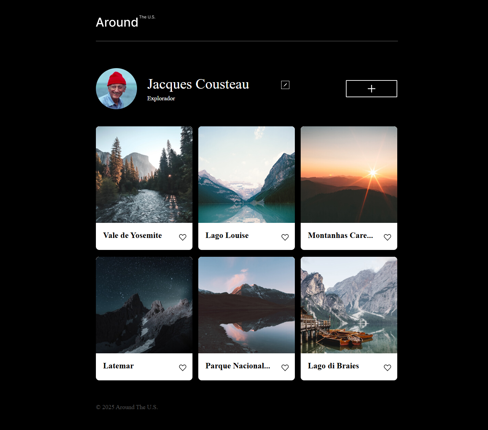

# 🌍 Tripleten web_project_around_react


[](https://perozin.github.io/web_project_around_react)

> 🎯 **Clique na imagem acima para acessar o projeto publicado**  
> 💡 **Click on the image above to access the published project**

---

## 🗣️ **README BILÍNGUE — Português / English**

---

## 🇧🇷 1. **Nome do Projeto**

**web_project_around_react**

---

## 🇧🇷 2. **Descrição do Projeto**

### Este projeto representa a evolução do **web_project_around**, migrado para a tecnologia **React** + **Vite** para proporcionar:

```
- componentização robusta
- reatividade com hooks
- carregamento rápido via Vite
- melhor organização do código
- mais escalabilidade e manutenção facilitada
```

### **Os usuários podem:**

```
🖼️ Exibir cards com imagens e legendas
➕ Adicionar novos cards
✏️ Editar informações do perfil
👤 Atualizar o avatar
👁️ Abrir imagens ampliadas através de modais
```

Agora, tudo utilizando **estado local**, **efeitos**, **JSX**, **componentização total** e **boas práticas** do **ecossistema React**.

---

## 🇺🇸 1. **Project Name**

**web_project_around_react**

---

## 🇺🇸 2. **Project Description**

### This project represents the evolution of **web_project_around**, migrated to **React + Vite** technology to provide:

```
- React functional components
- React Hooks (useState, useEffect)
- Component-driven UI
- Fast bundling with Vite
- Improved structure and scalability
```

### **Users can**:

```
🖼️ View image cards
➕ Add new cards
✏️ Edit profile info
👤 Change avatar
👁️ Preview images in modals
```

Now, everything uses **local state**, **effects**, **JSX**, **full componentization**, and **best practices** from the **React ecosystem**.

---

## 🎥 3. Demonstração / Demo

### 🎬 [▶️ Assista ao vídeo / Watch the video](https://www.loom.com/share/9f4b63da251f47d2b03a94cfd202466b)

---

## ⚙️ 4. Tecnologias Utilizadas / Technologies Used

```
| Categoria / Category           | Tecnologias e Técnicas / Technologies & Techniques |
| ------------------------------ | -------------------------------------------------- |
| **Front-end**                  | React 18, JSX, JavaScript ES6+                     |
| **Paradigma / Paradigm**       | Programação Declarativa / Declarative UI           |
| **Arquitetura / Architecture** | Componentização + Hooks / Componentization + Hooks |
| **Bundler**                    | Vite                                               |
| **Ambiente / Environment**     | React DevTools, VSCode, Git, GitHub                |
```

---

## 🧠 5. **Conceitos de React Aplicados / React Concepts Implemented**

```
| Conceito / Concept                                   | Descrição / Description                                                                                |
| ---------------------------------------------------- | ------------------------------------------------------------------------------------------------------ |
| **Componentes / Components**                         | UI dividida em unidades independentes e reutilizáveis / UI divided into independent and reusable units |
| **JSX**                                              | Sintaxe de template integrada ao JavaScript / Template syntax integrated into JavaScript               |
| **Props**                                            | Comunicação entre componentes / Communication between components                                       |
| **useState()**                                       | Gerenciamento de estado interno / Internal state management                                            |
| **useEffect()**                                      | Execução de efeitos colaterais / Side effects execution                                                |
| **Renderização Declarativa / Declarative Rendering** | UI sempre refletindo o estado atual / UI always reflecting the current state                           |
| **Virtual DOM**                                      | Atualizações eficientes e performáticas / Efficient and high-performance updates                       |
```

---

## 🏗️ 6. **Estrutura de Arquivos / File Structure (Vite + React)**

```
web_project_around_react/
├── public/
│ └── assets/
├── src/
│ ├── components/
│ │ ├── Card/
│ │ ├── Header/
│ │ ├── Footer/
│ │ ├── Popup/
│ │ ├── Profile/
│ │ └── Forms/
│ ├── hooks/
│ ├── pages/
│ │ └── App.jsx
│ ├── contexts/
│ ├── utils/
│ ├── styles/
│ └── main.jsx
├── index.html
├── package.json
├── vite.config.js
└── README.md
```

---

## 🧩 7. **Principais Funcionalidades / Key Features**

```
✅ Componentização completa / Complete componentization
✅ Estado isolado por componentes / Isolated state by components
✅ Hooks (useState, useEffect)
✅ Props para comunicação hierárquica / Props for hierarchical communication
✅ Modal React com controle de estado / Modal React with state control
✅ Adição dinâmica de cards / Dynamic card addition
✅ Exclusão e edição reativas / Reactive deletion and editing
✅ Estrutura preparada para API real no futuro / Structure prepared for real-world API development in the future.
```

---

## 🚀 8. **Como Executar / How to Run**

```bash
# 1️⃣ Clone o repositório / Clone the repository
git clone https://github.com/Perozin/web_project_around_react.git

# 2️⃣ Acesse a pasta / Access the folder
cd web_project_around_react

# 3️⃣ Instale as dependências / Install the dependencies.
npm install

# 4️⃣ Rode o servidor de desenvolvimento / Run the development server.
npm run dev
```

```
💡 **O Vite inicia automaticamente na porta exibida no terminal (ex.: http://localhost:5000)**
💡 **Vite starts automatically on the port displayed in the terminal (e.g., http://localhost:5000)**
```

---

## 🧾 9. **Resumo de Atualizações / Changelog**

### 📌 Introdução ao React / Introduction to React

- 🌐 JSX
- 🔧 Componentes funcionais e de classe / Functional and class components
- 🧩 Listas, chaves e eventos / Lists, keys, and events
- 🧠 DOM Virtual / Virtual DOM
- 📂 Abordagem declarativa / Declarative approach

### 📌 Ferramentas do React + Vite / Ferramentas do React + Vite

- 📱 Criação do projeto com Vite / Project creation with Vite
- 🌐 Estruturação profissional de pastas / Professional folder structuring
- 🔧 Importação de componentes, fontes, imagens / Importing components, fonts, and images.
- 🧩 React DevTools
- 🧠 Build e otimizações / Build and optimizations

### 📌 Hooks

- 📱 useState()
- 🌐 useEffect()
- 🔧 Dependências de efeito / Effect dependencies
- 🧩 Reatividade e renderizações controladas / Reactivity and controlled rendering

---

## 🚧 10. Próximos Passos / Next Steps

- [ ] 🔄 Integrar API real / Integrate real API (Node.js / Express)
- [ ] 🌐 Criar contexto global / Create a global context. (Context API)
- [ ] 🔐 Adicionar / To add useReducer()
- [ ] 🧩 Criar versão responsiva com / Create a responsive version with Styled Components ou Tailwind
- [ ] 🎨 Implementar autenticação / Implement authentication

---

## 👨‍💻 **Autor / Author**

**Márcio Perusin**  
Desenvolvedor Full Stack em formação / Full Stack Developer in training — Bootcamp **TripleTen**

🔗 [GitHub](https://github.com/Perozin)

🔗 [LinkedIn](https://www.linkedin.com/in/marcio-perozin)

---

## 📝 **Licença / License**

📄 Este projeto é de uso educacional e sem fins comerciais.  
📄 This project is for educational purposes only and has no commercial intent.
