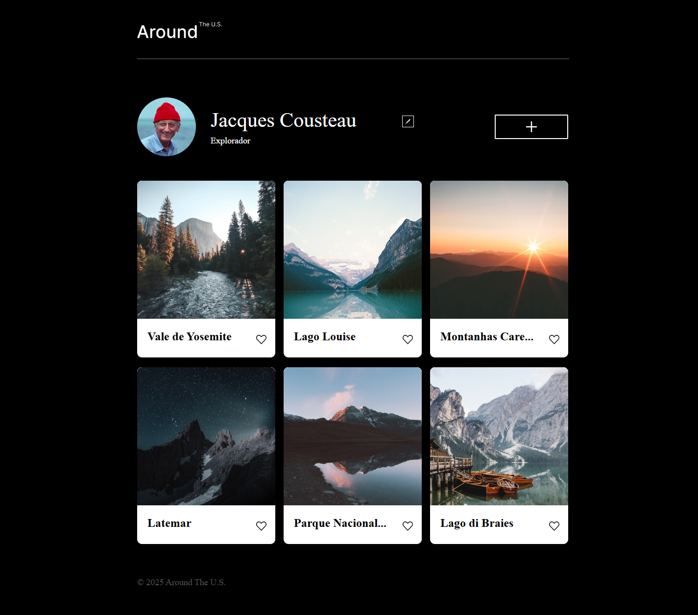

# 🌍 Tripleten web_project_around_react


[](https://perozin.github.io/web_project_around_react/)

> 🎯 **Clique na imagem acima para acessar o projeto publicado**  
> 💡 **Click on the image above to access the published project**

## 🗣️ **README BILÍNGUE —  Português |  English**

---

##  1. **Nome do Projeto**

**web_project_around_react**

---

##  2. **Descrição do Projeto**

### Este projeto representa a evolução do **web_project_around**, migrado para a tecnologia **React** + **Vite** para proporcionar:

```
- componentização robusta
- reatividade com hooks
- carregamento rápido via Vite
- melhor organização do código
- mais escalabilidade e manutenção facilitada
```

### **Os usuários podem:**

```
🖼️ Exibir cards com imagens e legendas
➕ Adicionar novos cards
✏️ Editar informações do perfil
👤 Atualizar o avatar
👁️ Abrir imagens ampliadas através de modais
```

Agora, tudo utilizando **estado local**, **efeitos**, **JSX**, **componentização total** e **boas práticas** do **ecossistema React**.

### 🔥 **Novidades**

Esse projeto trouxe **melhorias profundas na arquitetura**:

```
🚀 Reestruturação completa dos Popups
🧩 Padronização de props: onClose, onSubmit, isOpen
🎛️ Controle centralizado de modais no App.jsx
📦 Melhora na árvore de componentes
🖼️ PopupImage funcionando isoladamente
✏️ PopupEditProfile totalmente funcional
➕ PopupAddPlace integrado ao fluxo principal
👤 PopupEditAvatar reestruturado
```

A nova arquitetura agora segue:

- Um único **estado central** para controlar cada modal
- Todos os Popups recebem **isOpen, onClose e onSubmit**
- Estados limpos a cada abertura
- Identidade visual corrigida no CSS
- Componentes totalmente independentes

---

##  1. **Project Name**

**web_project_around_react**

---

##  2. **Project Description**

### This project represents the evolution of **web_project_around**, migrated to **React + Vite** technology to provide:

```
- React functional components
- React Hooks (useState, useEffect)
- Component-driven UI
- Fast bundling with Vite
- Improved structure and scalability
```

### **Users can**:

```
🖼️ View image cards
➕ Add new cards
✏️ Edit profile info
👤 Change avatar
👁️ Preview images in modals
```

Now, everything uses **local state**, **effects**, **JSX**, **full componentization**, and **best practices** from the **React ecosystem**.

### 🔥 **New Features**

This project brought **profound improvements to the architecture**:

```
🚀 Full popup architecture rebuilt
🧩 Standard props (onClose, onSubmit, isOpen)
📌 Central modal state in App.jsx
🖼️ PopupImage working cleanly
✏️ PopupEditProfile fully functional
➕ PopupAddPlace integrated smoothly
👤 PopupEditAvatar refactored and stable
```

The new architecture now follows:

- A single **central state** to control each modal
- All Popups receive **isOpen, onClose, and onSubmit** events
- States cleared on each opening
- Corrected visual identity in CSS
- Fully independent components

---

## 🎥 3. Demonstração / Demo

#### 🎬 [▶️ Assista ao vídeo / Watch the video](https://www.loom.com/share/9f4b63da251f47d2b03a94cfd202466b)

---

## ⚙️ 4. Tecnologias Utilizadas / Technologies Used

```
| Categoria / Category           | Tecnologias e Técnicas / Technologies & Techniques |
| ------------------------------ | -------------------------------------------------- |
| **Front-end**                  | React 18, JSX, JavaScript ES6+                     |
| **Paradigma / Paradigm**       | Programação Declarativa / Declarative UI           |
| **Arquitetura / Architecture** | Componentização + Hooks / Componentization + Hooks |
| **Bundler**                    | Vite                                               |
| **Ambiente / Environment**     | React DevTools, VSCode, Git, GitHub                |
```

---

## 🧠 5. **Conceitos de React Aplicados / React Concepts Implemented**

```
| Conceito / Concept           | Descrição / Description                                                               |
| ---------------------------- | ------------------------------------------------------------------------------------- |
| **Componentes / Components** | UI dividida em unidades independentes e reutilizáveis / Independent reusable UI units |
| **JSX**                      | Sintaxe integrada ao JavaScript / Template syntax integrated into JS                  |
| **Props**                    | Comunicação entre componentes / Communication between components                      |
| **useState()**               | Estado interno / Internal state                                                       |
| **useEffect()**              | Efeitos colaterais / Side effects                                                     |
| **Modais controlados**       | Popup flow managed entirely by React state                                            |
| **Lifting State Up**         | Estado compartilhado movido para o App.jsx                                            |
```

---

## 🏗️ 6. **Estrutura de Arquivos / File Structure (Vite + React)**

```
web_project_around_react/
├── public/
│ └── assets/
├── src/
│ ├── components/
│ │ ├── Card/
│ │ ├── Header/
│ │ ├── Footer/
│ │ ├── Popup/
│ │ │ ├── Popup.jsx
│ │ │ ├── PopupImage.jsx
│ │ │ ├── components/
│ │ │ │ ├── EditProfile/
│ │ │ │ ├── NewCard/
│ │ │ │ └── EditAvatar/
│ │ ├── Profile/
│ │ └── Forms/
│ ├── pages/
│ │ └── App.jsx
│ ├── styles/
│ ├── utils/
│ └── main.jsx
├── README.md
└── vite.config.js
```

---

## 🧩 7. **Principais Funcionalidades / Key Features**

```
✅ Componentização completa / Complete componentization
✅ Estado isolado e estruturado / Isolated and structured state
✅ Modais totalmente controlados / Fully controlled modals
✅ Efeitos e estados limpos a cada abertura / Clear effects and states on each opening
✅ Adição e remoção dinâmica de cards / Dynamic card addition and removal
✅ Edição de perfil funcional / Functional profile editing
✅ Atualização de avatar / Avatar update
✅ Visualização ampliada de imagens / Enlarged image view
```

---

## 🚀 8. **Como Executar / How to Run**

```bash
# 1️⃣ Clone o repositório / Clone the repository
git clone https://github.com/Perozin/web_project_around_react.git

# 2️⃣ Acesse a pasta / Access the folder
cd web_project_around_react

# 3️⃣ Instale as dependências / Install the dependencies.
npm install

# 4️⃣ Rode o servidor de desenvolvimento / Run the development server.
npm run dev
```

```
💡 **O Vite inicia automaticamente na porta exibida no terminal (ex.: http://localhost:5000)**
💡 **Vite starts automatically on the port displayed in the terminal (e.g., http://localhost:5000)**
```

---

## 🧾 9. **Resumo de Atualizações / Changelog**

### 📌 Projeto anterior / Previous project

- 🌐 Estrutura inicial dos componentes / Estrutura inicial dos componentes
- 🔧 Criação básica dos modais / Basic Modal Creation
- 🧩 Cards e perfil funcionais / Basic Modal Creation
- 🧠 Criação básica dos modais / Basic Modal Creation
- 📂 Cards e perfil funcionais / Basic Modal Creation

### 📌 Nova versão (reestruturação Completa dos Popups) / New version (complete restructuring of Popups)

- 🔥 Novo estado central no App.jsx / New central state in App.jsx
- 🧩 Todos os modais padronizados / All modals standardized
- 🧹 Limpeza automática de estados ao abrir / Automatic state clearing on opening
- 🎯 Correção dos erros "onClose is not a function" / Fixed "onClose is not a function" errors
- 📦 PopupImage isolado e funcional / Isolated and functional PopupImage
- ✏️ Edição de perfil redesenhada / Redesigned profile editing
- ➕ Novo card integrado ao fluxo / New card integrated into the flow
- 👤 Modal de avatar com validação / Avatar modal with validation
- 🎨 Correções de CSS e comportamento / CSS and behavior fixes

### 📌 Hooks

- 📱 useState()
- 🌐 useEffect()
- 🔧 Dependências de efeito / Effect dependencies
- 🧩 Reatividade e renderizações controladas / Reactivity and controlled rendering

---

## 🚧 10. Próximos Passos / Next Steps

- [ ] 🔄 Integrar API real / Integrate real API (Node.js / Express)
- [ ] 🌐 Criar contexto global / Create a global context. (Context API)
- [ ] 🔐 Implementar useReducer / To add useReducer
- [ ] 🧩 Criar versão responsiva com Styled Components ou Tailwin/ Create a responsive version with Styled Components ou Tailwind
- [ ] 🎨 Implementar autenticação / Implement authentication

---

## 👨‍💻 **Autor / Author**

**Márcio Perusin**  
Desenvolvedor Full Stack em formação — Bootcamp **TripleTen**

🔗 [GitHub](https://github.com/Perozin)
🔗 [LinkedIn](https://www.linkedin.com/in/marcio-perozin)

---

## 📝 **Licença / License**

📄 Este projeto é de uso educacional e sem fins comerciais.  
📄 This project is for educational purposes only and has no commercial intent.
